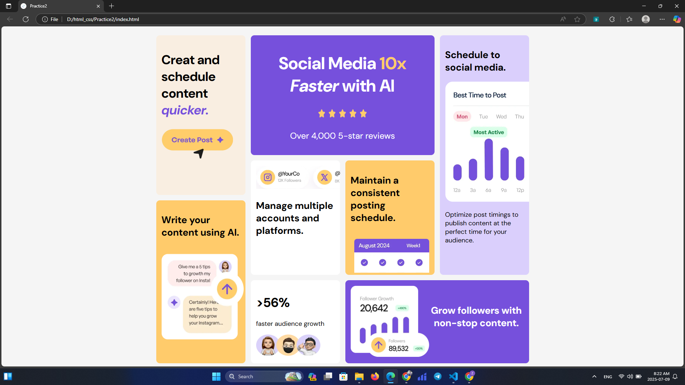

This project is an HTML and CSS exercise for the frontend. I used CSS Grid and responsive design to accomplish it.

preview

desktop:

mobile:

🧰 Technologies

HTML5 for semantic structure
CSS3 with modern layout techniques
CSS Grid for complex grid arrangements
Flexbox for flexible alignment
Media Queries for device adaptability
Custom Fonts using @font-face

📱 Responsive Behavior

This layout dynamically adjusts across different screen sizes:

- 💻 Large screens – Four-column layout 
- 📱 Tablets – single-column responsive grid 
- 📞 Mobiles – Single-column stacked view

🎯 Features

- Modular card-style layout
- Responsive typography and image scaling
- Fully adaptive grid-based design
- Lightweight and clean visual style
- Fonts integrated from local files
  

💡 Key Learnings

- Structuring reusable, semantic HTML components
- Implementing adaptive grid systems with CSS
- Using Flexbox and Grid in combination
- Creating pixel-perfect layouts across breakpoints

🚀 Getting Started

To view this project locally:

# Clone the repository
git clone https://github.com/zeynabGhne/CSS-Practice2.git
# Open the index.html file in your browser
